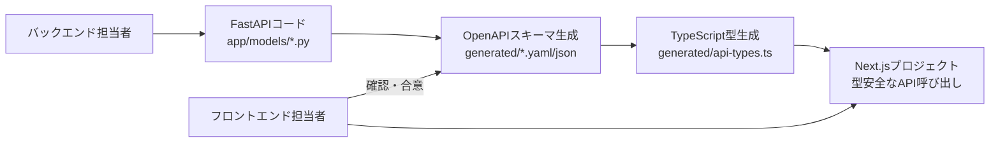

# 🚀 localLLM-FastAPI

[](https://fastapi.tiangolo.com)
[](https://python.org)
[](https://python-poetry.org)

## 概要

FastAPI経由で、localLLMを動かします。本格的なプロダクション環境で使用可能なスケーラブルなFastAPIアプリケーションです。自動生成ドキュメント、型安全なAPIエンドポイント、Next.jsプロジェクト向けのクライアントサイド型生成機能を提供します。

## ✨ 機能

- 🏗️ **モジュラーアーキテクチャ**: ルーター、サービス、モデルのクリーンな分離
- 📖 **自動生成ドキュメント**: カスタムOpenAPIスキーマを使ったSwagger UIとReDoc
- 🔄 **型生成**: クライアントサイド開発用の自動TypeScript型生成
- 🌐 **外部API統合**: 天気、名言、豆知識、ジョークのモックエンドポイント
- 🧪 **テキスト生成**: ルールベースのテキスト生成サービス（実際のLLMに拡張可能）
- ❤️ **ヘルスチェック**: 包括的なヘルス監視エンドポイント
- 🔧 **YAML設定**: 設定駆動開発
- 🌍 **CORS対応**: Next.js開発用の事前設定

## 🚀 セットアップ

### 前提条件

- Python 3.9+
- Poetry（依存関係管理用）

### インストール

1. **リポジトリのクローン**
   ```bash
   git clone https://github.com/ForLearnOrganization/localllm-fastapi.git
   cd localllm-fastapi
   ```

2. **Poetry の依存パッケージをインストール**
   ```bash
   poetry install
   ```

3. **APIサーバの起動**
   ```bash
   poetry run uvicorn main:app --reload
   ```

4. **アプリケーションへのアクセス**
   - **APIドキュメント**: http://localhost:8000/docs
   - **代替ドキュメント**: http://localhost:8000/redoc
   - **ルートページ**: http://localhost:8000/
   - **ヘルスチェック**: http://localhost:8000/api/v1/health/

## 📁 プロジェクト構造

```
localllm-fastapi/
├── app/
│   ├── api/v1/
│   │   ├── endpoints/
│   │   │   ├── health.py        # ヘルスチェックエンドポイント
│   │   │   ├── text.py          # テキスト生成エンドポイント
│   │   │   └── external.py      # 外部APIエンドポイント
│   │   └── __init__.py          # APIルーター設定
│   ├── core/
│   │   └── config.py            # アプリケーション設定
│   ├── models/
│   │   └── __init__.py          # Pydanticモデルとスキーマ
│   ├── services/
│   │   ├── text_service.py      # テキスト生成サービス
│   │   └── external_service.py  # 外部APIサービス
│   └── utils/
│       └── openapi.py           # OpenAPIユーティリティ
├── scripts/
│   ├── generate_client_types.py # 型生成用Pythonスクリプト
│   └── generate_types.sh        # 型生成用シェルスクリプト
├── generated/                   # 自動生成ファイル（初回実行時に作成）
│   ├── openapi.json
│   ├── openapi.yaml
│   └── api-types.ts
├── config.yaml                 # 設定ファイル
├── main.py                     # アプリケーションエントリーポイント
└── pyproject.toml              # Poetry設定
```

## 🔧 APIエンドポイント

### ヘルスエンドポイント
- `GET /api/v1/health/` - 基本的なヘルスチェック
- `GET /api/v1/health/detailed` - 詳細なヘルス情報

### テキスト生成
- `POST /api/v1/text/generate` - プロンプトからテキスト生成
- `POST /api/v1/text/echo` - メタデータ付きテキストエコー

### 外部API（モックデータ）
- `POST /api/v1/external/weather` - 天気情報取得
- `GET /api/v1/external/quote` - ランダムな名言取得
- `GET /api/v1/external/fact` - ランダムな豆知識取得
- `GET /api/v1/external/joke` - プログラミングジョーク取得

### 互換性エンドポイント
- `POST /generate` - 元の`/generate`エンドポイントとの後方互換性

## 🎯 使用例

### テキスト生成（新しいエンドポイント）
```bash
curl -X POST "http://localhost:8000/api/v1/text/generate" \
     -H "Content-Type: application/json" \
     -d '{"prompt": "Hello world", "max_length": 100}'
```

### テキスト生成（元の互換エンドポイント）
```bash
curl -X POST "http://localhost:8000/generate" \
     -H "Content-Type: application/json" \
     -d '{"prompt": "百人一首っぽい言葉を並べて。"}'
```

### 天気API
```bash
curl -X POST "http://localhost:8000/api/v1/external/weather" \
     -H "Content-Type: application/json" \
     -d '{"city": "Tokyo", "country_code": "JP"}'
```

### ランダムな名言
```bash
curl -X GET "http://localhost:8000/api/v1/external/quote"
```

## 🔄 開発運用フロー

このプロジェクトでは **FastAPIコード → OpenAPIスキーマ → TypeScript型定義** の流れで型安全な開発を実現します。

### 運用フロー概要



### バックエンド担当者の作業手順

1. **Pydanticモデルの定義/更新**
   ```bash
   # app/models/__init__.py でAPIリクエスト/レスポンスモデルを定義
   vim app/models/__init__.py
   ```

2. **エンドポイントの実装**
   ```bash
   # 新しいエンドポイントを app/api/v1/endpoints/ に追加
   vim app/api/v1/endpoints/new_feature.py
   ```

3. **ルーターへの登録**
   ```bash
   # app/api/v1/__init__.py でルーターを登録
   vim app/api/v1/__init__.py
   ```

4. **OpenAPIスキーマの生成・確認**
   ```bash
   # サーバーを起動してスキーマを確認
   poetry run uvicorn main:app --reload
   
   # ブラウザで http://localhost:8000/docs にアクセスしてAPI仕様を確認
   # 自動生成スキーマは http://localhost:8000/openapi.json で確認可能
   ```

5. **フロントエンド向け型定義の生成**
   ```bash
   # TypeScript型定義を生成
   ./scripts/generate_types.sh
   ```

### フロントエンド担当者の作業手順

1. **API仕様の確認・合意**
   ```bash
   # 生成されたOpenAPIスキーマを確認
   cat generated/openapi.yaml
   
   # または Swagger UI で確認: http://localhost:8000/docs
   ```

2. **TypeScript型定義の取得**
   ```bash
   # 最新の型定義を生成（バックエンド担当者と調整）
   ./scripts/generate_types.sh
   
   # Next.jsプロジェクトに型定義をコピー
   cp generated/api-types.ts your-nextjs-project/types/api.ts
   ```

3. **Next.jsプロジェクトでの型安全なAPI呼び出し**
   ```typescript
   // types/api.ts から型定義をインポート
   import { WeatherRequest, WeatherResponse, API_ENDPOINTS } from './types/api';

   // fetchを使用した型安全なAPI呼び出し
   const getWeather = async (request: WeatherRequest): Promise<WeatherResponse> => {
     const response = await fetch(
       `${process.env.NEXT_PUBLIC_API_URL}${API_ENDPOINTS.EXTERNAL_WEATHER}`,
       {
         method: 'POST',
         headers: {
           'Content-Type': 'application/json',
         },
         body: JSON.stringify(request),
       }
     );
     
     if (!response.ok) {
       throw new Error(`HTTP error! status: ${response.status}`);
     }
     
     return response.json() as WeatherResponse;
   };
   ```

### 新しいエンドポイント追加時の完全な手順

1. **Pydanticモデルの定義** (`app/models/__init__.py`)
   ```python
   class NewFeatureRequest(BaseModel):
       param1: str = Field(..., description="パラメータ1の説明")
       param2: Optional[int] = Field(None, description="オプションパラメータ")

   class NewFeatureResponse(BaseModel):
       result: str = Field(..., description="処理結果")
       status: str = Field(..., description="ステータス")
   ```

2. **サービスロジックの実装** (`app/services/`)
   ```python
   # app/services/new_feature_service.py
   async def process_new_feature(request: NewFeatureRequest) -> NewFeatureResponse:
       # ビジネスロジックを実装
       pass
   ```

3. **エンドポイントの実装** (`app/api/v1/endpoints/`)
   ```python
   # app/api/v1/endpoints/new_feature.py
   from fastapi import APIRouter
   from app.models import NewFeatureRequest, NewFeatureResponse
   from app.services.new_feature_service import process_new_feature

   router = APIRouter()

   @router.post("/new-feature", response_model=NewFeatureResponse)
   async def new_feature_endpoint(request: NewFeatureRequest):
       """新機能のエンドポイント"""
       return await process_new_feature(request)
   ```

4. **ルーターの登録** (`app/api/v1/__init__.py`)
   ```python
   from app.api.v1.endpoints import new_feature
   
   # ルーターを追加
   api_router.include_router(new_feature.router, tags=["new-feature"])
   ```

5. **型定義の更新・配布**
   ```bash
   # 型定義を再生成
   ./scripts/generate_types.sh
   
   # フロントエンドチームに更新を通知
   git add generated/
   git commit -m "feat: 新機能APIエンドポイントの型定義を追加"
   ```

## 📦 クライアントサイド型生成

### 型生成コマンド

```bash
# シェルスクリプトを使用（推奨）
./scripts/generate_types.sh

# または Pythonスクリプト直接実行
poetry run python scripts/generate_client_types.py
```

### Next.js統合の詳細手順

1. **型定義ファイルのコピー**
   ```bash
   # プロジェクトルートから実行
   cp generated/api-types.ts /path/to/your-nextjs-project/types/api.ts
   ```

2. **環境変数の設定**
   ```bash
   # .env.local に追加
   NEXT_PUBLIC_API_URL=http://localhost:8000
   ```

3. **共通APIクライアントの作成** (`lib/api-client.ts`)
   ```typescript
   import { ApiClientConfig, ApiEndpoint, HttpMethod } from '@/types/api';

   class ApiClient {
     private config: ApiClientConfig;

     constructor(config: ApiClientConfig) {
       this.config = config;
     }

     async request<T>(
       endpoint: ApiEndpoint,
       method: HttpMethod = 'GET',
       data?: any
     ): Promise<T> {
       const url = `${this.config.baseUrl}${endpoint}`;
       
       const options: RequestInit = {
         method,
         headers: {
           'Content-Type': 'application/json',
           ...this.config.headers,
         },
       };

       if (data && (method === 'POST' || method === 'PUT' || method === 'PATCH')) {
         options.body = JSON.stringify(data);
       }

       const response = await fetch(url, options);
       
       if (!response.ok) {
         throw new Error(`HTTP error! status: ${response.status}`);
       }

       return response.json();
     }
   }

   // デフォルトクライアントインスタンス
   export const apiClient = new ApiClient({
     baseUrl: process.env.NEXT_PUBLIC_API_URL || 'http://localhost:8000',
     timeout: 10000,
   });
   ```

4. **型安全なAPI関数の作成** (`lib/api.ts`)
   ```typescript
   import { apiClient } from './api-client';
   import { 
     WeatherRequest, 
     WeatherResponse, 
     TextGenerateRequest, 
     TextGenerateResponse,
     API_ENDPOINTS 
   } from '@/types/api';

   // 天気API
   export const getWeather = async (request: WeatherRequest): Promise<WeatherResponse> => {
     return apiClient.request<WeatherResponse>(
       API_ENDPOINTS.EXTERNAL_WEATHER, 
       'POST', 
       request
     );
   };

   // テキスト生成API
   export const generateText = async (request: TextGenerateRequest): Promise<TextGenerateResponse> => {
     return apiClient.request<TextGenerateResponse>(
       API_ENDPOINTS.TEXT_GENERATE, 
       'POST', 
       request
     );
   };

   // ヘルスチェック
   export const getHealthStatus = async () => {
     return apiClient.request(API_ENDPOINTS.HEALTH, 'GET');
   };
   ```

5. **Reactコンポーネントでの使用例**
   ```typescript
   'use client';
   
   import { useState } from 'react';
   import { getWeather } from '@/lib/api';
   import { WeatherRequest, WeatherResponse } from '@/types/api';

   export default function WeatherComponent() {
     const [weather, setWeather] = useState<WeatherResponse | null>(null);
     const [loading, setLoading] = useState(false);

     const fetchWeather = async () => {
       setLoading(true);
       try {
         const request: WeatherRequest = {
           city: 'Tokyo',
           country_code: 'JP'
         };
         
         const result = await getWeather(request);
         setWeather(result);
       } catch (error) {
         console.error('天気データの取得に失敗しました:', error);
       } finally {
         setLoading(false);
       }
     };

     return (
       <div>
         <button onClick={fetchWeather} disabled={loading}>
           {loading ? '読み込み中...' : '天気を取得'}
         </button>
         {weather && (
           <div>
             <h3>{weather.city}の天気</h3>
             <p>温度: {weather.temperature}°C</p>
             <p>状況: {weather.description}</p>
           </div>
         )}
       </div>
     );
   }
   ```

## ⚙️ 設定

アプリケーションはYAMLベースの設定を使用します。`config.yaml`を編集してカスタマイズ：

```yaml
app:
  name: "localLLM-FastAPI"
  version: "1.0.0"
  debug: true

api:
  v1_prefix: "/api/v1"

cors:
  origins:
    - "http://localhost:3000"
    - "http://localhost:8000"

external_apis:
  weather:
    mock_mode: true
    api_key: "your-api-key"
```

## 🧪 開発

### テストの実行
```bash
poetry run pytest
```

### コードフォーマット
```bash
poetry run black .
poetry run isort .
```

### 型チェック
```bash
poetry run mypy .
```

### 新しいエンドポイントの追加

1. **エンドポイントファイルを作成** `app/api/v1/endpoints/`内に
2. **Pydanticモデルを定義** `app/models/__init__.py`内に
3. **ビジネスロジックを実装** `app/services/`内に
4. **ルーターを登録** `app/api/v1/__init__.py`内に

新しいエンドポイントの例：
```python
# app/api/v1/endpoints/new_feature.py
from fastapi import APIRouter
from app.models import NewFeatureRequest, NewFeatureResponse

router = APIRouter()

@router.post("/new-endpoint", response_model=NewFeatureResponse)
async def new_endpoint(request: NewFeatureRequest):
    """新機能のエンドポイント"""
    # 実装をここに
    pass
```

## 🌐 デプロイメント

### 本番環境セットアップ
```bash
# 本番用依存関係をインストール
poetry install --no-dev

# Gunicornで実行
poetry run gunicorn main:app -w 4 -k uvicorn.workers.UvicornWorker
```

### Docker（オプション）
```dockerfile
FROM python:3.9
WORKDIR /app
COPY pyproject.toml poetry.lock ./
RUN pip install poetry && poetry install --no-dev
COPY . .
CMD ["poetry", "run", "uvicorn", "main:app", "--host", "0.0.0.0", "--port", "8000"]
```

## その他の便利なコマンド

- **依存関係の追加**
  新たなパッケージを追加する場合：
  ```bash
  poetry add <package_name>
  ```

- **依存関係の更新**
  すべての依存関係を更新：
  ```bash
  poetry update
  ```

- **仮想環境の確認**
  Poetry管理下の仮想環境情報を確認：
  ```bash
  poetry env info
  ```

- **Poetry シェルに入る**
  Poetry管理の仮想環境内で作業：
  ```bash
  poetry shell
  ```

## 🤝 コントリビューション

1. リポジトリをフォーク
2. フィーチャーブランチを作成
3. 変更を加える
4. 該当する場合はテストを追加
5. リンターとテストを実行
6. プルリクエストを送信

## 📄 ライセンス

このプロジェクトはMITライセンスの下でライセンスされています。

## 🔗 リンク

- [FastAPI ドキュメント](https://fastapi.tiangolo.com/)
- [Pydantic ドキュメント](https://pydantic-docs.helpmanual.io/)
- [Poetry ドキュメント](https://python-poetry.org/docs/)

---

❤️ FastAPIとモダンなPython開発プラクティスで構築