# 🚀 localLLM-FastAPI

[](https://fastapi.tiangolo.com)
[](https://python.org)
[](https://python-poetry.org)

## 概要

FastAPI経由で、localLLMを動かします。本格的なプロダクション環境で使用可能なスケーラブルなFastAPIアプリケーションです。自動生成ドキュメント、型安全なAPIエンドポイント、Next.jsプロジェクト向けのクライアントサイド型生成機能を提供します。

## ✨ 機能

- 🏗️ **モジュラーアーキテクチャ**: ルーター、サービス、モデルのクリーンな分離
- 📖 **自動生成ドキュメント**: カスタムOpenAPIスキーマを使ったSwagger UIとReDoc
- 🔄 **型生成**: クライアントサイド開発用の自動TypeScript型生成
- 🌐 **外部API統合**: 天気、名言、豆知識、ジョークのモックエンドポイント
- 🧪 **テキスト生成**: ルールベースのテキスト生成サービス（実際のLLMに拡張可能）
- ❤️ **ヘルスチェック**: 包括的なヘルス監視エンドポイント
- 🔧 **YAML設定**: 設定駆動開発
- 🌍 **CORS対応**: Next.js開発用の事前設定
- ⚡ **APIエンドポイント自動生成**: レジストリベースの自動ルーター生成システム
- 📄 **HTMLドキュメント生成**: 静的なSwagger UIとReDocファイルの自動生成

## 🔧 APIエンドポイント自動生成システム

### エンドポイント追加の流れ

1. **エンドポイント設定の追加**
   ```python
   # app/api/endpoint_registry.py に追加
   EndpointConfig(
       prefix="/新しいエンドポイント",
       tags=["タグ名"],
       module="app.api.v1.endpoints.新しいファイル",
       description="エンドポイントの説明",
   ),
   ```

2. **実装ファイルの作成**
   ```bash
   # app/api/v1/endpoints/新しいファイル.py を作成
   # FastAPIルーターとエンドポイントを実装
   ```

3. **自動生成の実行**
   ```bash
   # すべてを一括生成
   ./scripts/generate_all.sh
   
   # または個別実行
   python scripts/generate_router.py     # ルーター生成
   python scripts/generate_docs.py       # ドキュメント生成
   ```

### 生成されるファイル

| ファイル | 用途 | 格納場所 |
|---------|------|----------|
| `app/api/v1/__init__.py` | 自動生成されたAPIルーター | 手動管理不要 |
| `docs/generated/openapi.json` | OpenAPIスキーマ（JSON） | 型生成用 |
| `docs/generated/openapi.yaml` | OpenAPIスキーマ（YAML） | 人間確認用 |
| `docs/static/swagger.html` | Swagger UI（静的HTML） | ドキュメント配布用 |
| `docs/static/redoc.html` | ReDoc（静的HTML） | ドキュメント配布用 |
| `generated/api-types.ts` | TypeScript型定義 | Next.js開発用 |

### ディレクトリ構造

```
localllm-fastapi/
├── app/
│   ├── api/
│   │   ├── endpoint_registry.py    # 📝 エンドポイント設定（手動管理）
│   │   └── v1/
│   │       ├── __init__.py         # 🤖 自動生成ルーター
│   │       └── endpoints/          # 📁 エンドポイント実装
├── scripts/
│   ├── generate_router.py          # 🔧 ルーター生成スクリプト
│   ├── generate_docs.py            # 📄 ドキュメント生成スクリプト
│   └── generate_all.sh             # ⚡ 一括生成スクリプト
├── docs/
│   ├── generated/                  # 🤖 自動生成スキーマ
│   └── static/                     # 📄 静的HTMLドキュメント
└── source/
    └── config.yaml                 # 📝 手動設定ファイル
```

## 🚀 セットアップ

### 前提条件

- Python 3.9+
- Poetry（依存関係管理用）
- Node.js（フロントエンド開発時）

### インストール

1. **リポジトリのクローン**
   ```bash
   git clone https://github.com/ForLearnOrganization/localllm-fastapi.git
   cd localllm-fastapi
   ```

2. **Poetry の依存パッケージをインストール**
   ```bash
   poetry install
   ```

3. **開発環境の設定**
   ```bash
   poetry shell  # 仮想環境をアクティベート
   ```

4. **APIサーバの起動**
   ```bash
   poetry run uvicorn main:app --reload
   ```

5. **アプリケーションへのアクセス**
   - **APIドキュメント**: http://localhost:8000/docs
   - **代替ドキュメント**: http://localhost:8000/redoc
   - **ルートページ**: http://localhost:8000/

## 📁 プロジェクト構造

```
localllm-fastapi/
├── .vscode/                    # VSCode設定
│   ├── settings.json          # エディタ設定（Ruff自動フォーマット）
│   └── extensions.json        # 推奨拡張機能
├── app/                       # アプリケーションソース
│   ├── api/v1/endpoints/      # APIルートハンドラー
│   ├── core/                  # 設定とコア機能
│   ├── models/               # Pydanticスキーマ
│   ├── services/             # ビジネスロジック
│   └── utils/                # ユーティリティ関数
├── scripts/                   # 型生成・ドキュメント生成スクリプト
│   ├── generate_client_types.py
│   ├── generate_types.sh
│   ├── generate_docs.py       # 📄 新規: HTML ドキュメント生成
│   └── generate_docs.sh       # 📄 新規: ドキュメント生成スクリプト
├── docs/                      # 📁 新規: ドキュメント管理
│   ├── generated/            # 🤖 自動生成: OpenAPIスキーマ
│   └── static/               # 🤖 自動生成: 静的HTMLドキュメント
├── generated/                 # 🤖 自動生成: TypeScript型定義
├── source/                    # 📁 手動管理: ソース用YAML等
├── config.yaml               # アプリケーション設定
└── main.py                   # アプリケーションエントリーポイント
```

## 🔄 開発運用フロー

### バックエンド開発者の作業フロー

1. **新しいエンドポイントの設定**
   ```python
   # app/api/endpoint_registry.py にエンドポイント設定を追加
   EndpointConfig(
       prefix="/new-feature",
       tags=["features"],
       module="app.api.v1.endpoints.new_feature",
       description="新機能関連のエンドポイント",
   ),
   ```

2. **Pydanticモデルの定義**
   ```python
   # app/models/で新しいAPIモデルを定義
   class NewFeatureRequest(BaseModel):
       name: str
       description: str
       
   class NewFeatureResponse(BaseModel):
       id: int
       name: str
       status: str
   ```

3. **APIエンドポイントの実装**
   ```python
   # app/api/v1/endpoints/new_feature.py を作成
   from fastapi import APIRouter
   from app.models import NewFeatureRequest, NewFeatureResponse
   
   router = APIRouter()
   
   @router.post("/create", response_model=NewFeatureResponse)
   async def create_feature(request: NewFeatureRequest):
       # ビジネスロジックの実装
       return NewFeatureResponse(id=1, name=request.name, status="created")
   ```

4. **ルーター・ドキュメント・型定義の一括生成**
   ```bash
   # 全自動生成（推奨）
   ./scripts/generate_all.sh
   
   # または個別実行
   python scripts/generate_router.py     # APIルーター自動生成
   python scripts/generate_docs.py       # ドキュメント・型定義生成
   ```

5. **動作確認**
   ```bash
   # サーバー起動
   python main.py
   
   # エンドポイント確認
   curl -X POST "http://localhost:8000/api/v1/new-feature/create" \
        -H "Content-Type: application/json" \
        -d '{"name": "テスト機能", "description": "説明"}'
   
   # ドキュメント確認
   open http://localhost:8000/docs
   ```

### フロントエンド開発者の作業フロー

1. **生成された型定義とAPIエンドポイントの確認**
   ```bash
   # バックエンド開発者が生成した型定義を確認
   cat generated/api-types.ts
   
   # 静的HTMLドキュメントでAPI仕様を確認
   open docs/static/swagger.html
   open docs/static/redoc.html
   ```

2. **型安全なAPIクライアントの実装**
   ```typescript
   // Next.jsアプリケーション内
   import { NewFeatureRequest, NewFeatureResponse, API_ENDPOINTS } from '@/types/api';

   // モダンなfetch APIを使用（axiosではなく）
   const createFeature = async (request: NewFeatureRequest): Promise<NewFeatureResponse> => {
     const response = await fetch(`${process.env.NEXT_PUBLIC_API_URL}${API_ENDPOINTS.NEW_FEATURE_CREATE}`, {
       method: 'POST',
       headers: {
         'Content-Type': 'application/json',
       },
       body: JSON.stringify(request),
     });

     if (!response.ok) {
       throw new Error(`HTTP error! status: ${response.status}`);
     }

     return response.json();
   };
   ```

3. **エラーハンドリング付きの完全な実装例**
   ```typescript
   // app/lib/api.ts
   class APIClient {
     private baseURL: string;

     constructor(baseURL: string) {
       this.baseURL = baseURL;
     }

     async request<T>(endpoint: string, options: RequestInit = {}): Promise<T> {
       const url = `${this.baseURL}${endpoint}`;
       const config: RequestInit = {
         headers: {
           'Content-Type': 'application/json',
           ...options.headers,
         },
         ...options,
       };

       const response = await fetch(url, config);

       if (!response.ok) {
         throw new Error(`API Error: ${response.status} ${response.statusText}`);
       }

       return response.json();
     }

     // 型安全なメソッド例
     async getHealth(): Promise<HealthResponse> {
       return this.request<HealthResponse>(API_ENDPOINTS.HEALTH);
     }

     async generateText(request: GenerateRequest): Promise<GenerateResponse> {
       return this.request<GenerateResponse>(API_ENDPOINTS.TEXT_GENERATE, {
         method: 'POST',
         body: JSON.stringify(request),
       });
     }
   }

   export const apiClient = new APIClient(process.env.NEXT_PUBLIC_API_URL || 'http://localhost:8000');
   ```

### チーム間の連携フロー

1. **API設計の合意**
   - バックエンド開発者が`app/api/endpoint_registry.py`でエンドポイント概要を定義
   - Pydanticモデルで詳細なAPIスキーマを定義
   - フロントエンド開発者が`docs/generated/openapi.yaml`または静的HTMLドキュメントを確認
   - 必要に応じてSlack/GitHub等でレビュー・議論

2. **自動生成と型定義の共有**
   ```bash
   # バックエンド開発者が一括生成・コミット
   ./scripts/generate_all.sh
   git add app/api/v1/__init__.py docs/ generated/
   git commit -m "feat: 新機能APIエンドポイント追加"
   git push
   ```

3. **フロントエンド開発開始**
   ```bash
   # フロントエンド開発者が最新の型定義を取得
   git pull
   # generated/api-types.tsを使用して型安全な開発を開始
   # docs/static/swagger.htmlで仕様を詳細確認
   ```

### 🔄 継続的な開発サイクル

```mermaid
graph LR
    A[エンドポイント設定] --> B[実装ファイル作成]
    B --> C[自動生成実行]
    C --> D[型定義・ドキュメント更新]
    D --> E[チーム共有]
    E --> F[フロントエンド開発]
    F --> A
```



1. `app/api/endpoint_registry.py` に設定追加
2. `app/api/v1/endpoints/` に実装ファイル作成
3. `./scripts/generate_all.sh` で一括生成
4. 生成ファイルをコミット・プッシュ
5. フロントエンド開発者が最新型定義を使用
6. 次の機能開発へ

## 🔧 開発ツール設定

### VSCode自動フォーマット設定

プロジェクトには`.vscode/settings.json`が含まれており、以下の機能が自動で有効になります：

- **Ruffによる自動フォーマット**: ファイル保存時にコード整形
- **インポート自動整理**: isort互換の自動インポート整理
- **構文エラー検出**: リアルタイムでのコード検証

### Ruff vs Black + isort の選択理由

**🚀 Ruffを選択した理由:**

1. **パフォーマンス**: Rustで書かれており、Black+isortより10-100倍高速
2. **統合性**: linting（flake8相当）とformatting（black相当）を1つのツールで提供
3. **設定簡素化**: pyproject.toml内の単一設定で完了
4. **互換性**: BlackやisortとほぼUIベル・フォーマット結果
5. **メンテナンス**: アクティブな開発と定期的な更新

**従来のBlack + isortからの移行メリット:**
- 設定ファイルの簡素化（pyproject.tomlの[tool.ruff]セクションのみ）
- ビルド・CI時間の短縮
- VSCodeでの応答性向上
- 依存関係の削減

**設定例（pyproject.toml）:**
```toml
[tool.ruff]
target-version = "py39"
line-length = 88
select = ["E", "W", "F", "I", "B", "C4", "UP"]

[tool.ruff.format]
quote-style = "double"
indent-style = "space"

[tool.ruff.isort]
known-first-party = ["app"]
```

### 手動でのフォーマット実行

```bash
# すべてのPythonファイルをフォーマット
poetry run ruff format .

# Linting実行（エラー検出）
poetry run ruff check .

# Linting + 自動修正
poetry run ruff check . --fix
## 📄 HTMLドキュメント生成

### 静的HTMLドキュメントの生成

このプロジェクトでは、静的HTMLドキュメントを生成して、開発環境の外でもAPIドキュメントを確認できます。

```bash
# すべてのドキュメントを一括生成
./scripts/generate_docs.sh

# または個別生成
python scripts/generate_docs.py
```

### 生成されるファイル

| ファイル | 説明 | 用途 |
|---------|------|------|
| `docs/generated/openapi.json` | 機械可読なAPIスキーマ | API仕様の自動検証・統合 |
| `docs/generated/openapi.yaml` | 人間可読なAPIスキーマ | チームでのAPI仕様レビュー |
| `docs/static/redoc.html` | ReDoc形式の静的HTML | オフライン・配布用ドキュメント |
| `docs/static/swagger.html` | Swagger UI形式の静的HTML | インタラクティブなAPI試行 |
| `generated/api-types.ts` | TypeScript型定義 | フロントエンド開発用 |

### 静的HTMLドキュメントの利用

1. **ReDocドキュメント**: `docs/static/redoc.html`をブラウザで開く
2. **Swagger UIドキュメント**: `docs/static/swagger.html`をブラウザで開く
3. **チーム配布**: `docs/static/`フォルダをzipで配布
4. **CI/CDとの統合**: ビルド時に自動生成・デプロイ

## 🔧 APIエンドポイント

### ヘルスエンドポイント
- `GET /api/v1/health/` - 基本的なヘルスチェック
- `GET /api/v1/health/detailed` - 詳細なヘルス情報

### テキスト生成
- `POST /api/v1/text/generate` - プロンプトからテキスト生成
- `POST /api/v1/text/echo` - メタデータ付きテキストエコー

### 外部API（モックデータ）
- `POST /api/v1/external/weather` - 天気情報取得
- `GET /api/v1/external/quote` - ランダムな名言取得
- `GET /api/v1/external/fact` - ランダムな豆知識取得
- `GET /api/v1/external/joke` - プログラミングジョーク取得

### 互換性エンドポイント
- `POST /generate` - 元の`/generate`エンドポイントとの後方互換性

## 🎯 使用例

### テキスト生成（新しいエンドポイント）
```bash
curl -X POST "http://localhost:8000/api/v1/text/generate" \
     -H "Content-Type: application/json" \
     -d '{"prompt": "Hello world", "max_length": 100}'
```

### テキスト生成（元の互換エンドポイント）
```bash
curl -X POST "http://localhost:8000/generate" \
     -H "Content-Type: application/json" \
     -d '{"prompt": "百人一首っぽい言葉を並べて。"}'
```

### 天気API
```bash
curl -X POST "http://localhost:8000/api/v1/external/weather" \
     -H "Content-Type: application/json" \
     -d '{"city": "Tokyo", "country_code": "JP"}'
```

### ランダムな名言
```bash
curl -X GET "http://localhost:8000/api/v1/external/quote"
```

## 📚 ドキュメント生成

### 静的HTMLドキュメント
当プロジェクトは静的HTMLドキュメントを自動生成し、`docs/static/` に格納します：

- **Swagger UI**: `docs/static/swagger.html` - インタラクティブなAPI仕様書
- **ReDoc**: `docs/static/redoc.html` - 読みやすいドキュメント形式

### ドキュメント生成コマンド

#### 全ドキュメント・型・コード生成
```bash
./scripts/generate_all.sh
```

#### ドキュメント専用生成
```bash
./scripts/generate_docs_only.sh
# または
python scripts/generate_docs_only.py
```

#### コード専用生成（型定義・ルーター）
```bash
./scripts/generate_code_only.sh
# または  
python scripts/generate_code_only.py
```

#### 個別生成
```bash
# TypeScript型定義のみ
./scripts/generate_types.sh

# APIルーターのみ
python scripts/generate_router.py

# 従来の統合生成（ドキュメント・型定義）
python scripts/generate_docs.py
```

## 📦 クライアントサイド型生成

### 型生成コマンド

```bash
# すべてのドキュメント・型を一括生成（推奨）
./scripts/generate_all.sh

# TypeScript型のみ生成
./scripts/generate_types.sh

# または Pythonスクリプト直接実行
poetry run python scripts/generate_client_types.py
```

### Next.js統合の詳細手順

1. **型定義ファイルのコピー**
   ```bash
   # プロジェクトルートから実行
   cp generated/api-types.ts /path/to/your-nextjs-project/types/api.ts
   ```

2. **環境変数の設定**
   ```bash
   # .env.local に追加
   NEXT_PUBLIC_API_URL=http://localhost:8000
   ```

3. **共通APIクライアントの作成** (`lib/api-client.ts`)
   ```typescript
   import { ApiClientConfig, ApiEndpoint, HttpMethod } from '@/types/api';

   class ApiClient {
     private config: ApiClientConfig;

     constructor(config: ApiClientConfig) {
       this.config = config;
     }

     async request<T>(
       endpoint: ApiEndpoint,
       method: HttpMethod = 'GET',
       data?: any
     ): Promise<T> {
       const url = `${this.config.baseUrl}${endpoint}`;
       
       const options: RequestInit = {
         method,
         headers: {
           'Content-Type': 'application/json',
           ...this.config.headers,
         },
       };

       if (data && (method === 'POST' || method === 'PUT' || method === 'PATCH')) {
         options.body = JSON.stringify(data);
       }

       const response = await fetch(url, options);
       
       if (!response.ok) {
         throw new Error(`HTTP error! status: ${response.status}`);
       }

       return response.json();
     }
   }

   // デフォルトクライアントインスタンス
   export const apiClient = new ApiClient({
     baseUrl: process.env.NEXT_PUBLIC_API_URL || 'http://localhost:8000',
     timeout: 10000,
   });
   ```

4. **型安全なAPI関数の作成** (`lib/api.ts`)
   ```typescript
   import { apiClient } from './api-client';
   import { 
     WeatherRequest, 
     WeatherResponse, 
     TextGenerateRequest, 
     TextGenerateResponse,
     API_ENDPOINTS 
   } from '@/types/api';

   // 天気API
   export const getWeather = async (request: WeatherRequest): Promise<WeatherResponse> => {
     return apiClient.request<WeatherResponse>(
       API_ENDPOINTS.EXTERNAL_WEATHER, 
       'POST', 
       request
     );
   };

   // テキスト生成API
   export const generateText = async (request: TextGenerateRequest): Promise<TextGenerateResponse> => {
     return apiClient.request<TextGenerateResponse>(
       API_ENDPOINTS.TEXT_GENERATE, 
       'POST', 
       request
     );
   };

   // ヘルスチェック
   export const getHealthStatus = async () => {
     return apiClient.request(API_ENDPOINTS.HEALTH, 'GET');
   };
   ```

5. **Reactコンポーネントでの使用例**
   ```typescript
   'use client';
   
   import { useState } from 'react';
   import { getWeather } from '@/lib/api';
   import { WeatherRequest, WeatherResponse } from '@/types/api';

   export default function WeatherComponent() {
     const [weather, setWeather] = useState<WeatherResponse | null>(null);
     const [loading, setLoading] = useState(false);

     const fetchWeather = async () => {
       setLoading(true);
       try {
         const request: WeatherRequest = {
           city: 'Tokyo',
           country_code: 'JP'
         };
         
         const result = await getWeather(request);
         setWeather(result);
       } catch (error) {
         console.error('天気データの取得に失敗しました:', error);
       } finally {
         setLoading(false);
       }
     };

     return (
       <div>
         <button onClick={fetchWeather} disabled={loading}>
           {loading ? '読み込み中...' : '天気を取得'}
         </button>
         {weather && (
           <div>
             <h3>{weather.city}の天気</h3>
             <p>温度: {weather.temperature}°C</p>
             <p>状況: {weather.description}</p>
           </div>
         )}
       </div>
     );
   }
   ```

## ⚙️ 設定

アプリケーションはYAMLベースの設定を使用します。`config.yaml`を編集してカスタマイズ：

```yaml
app:
  name: "localLLM-FastAPI"
  version: "1.0.0"
  debug: true

api:
  v1_prefix: "/api/v1"

cors:
  origins:
    - "http://localhost:3000"
    - "http://localhost:8000"

external_apis:
  weather:
    mock_mode: true
    api_key: "your-api-key"
```

## 🧪 開発

### テストの実行
```bash
poetry run pytest
```

### コードフォーマット・リンティング
```bash
# Ruffによる自動フォーマット（推奨）
poetry run ruff format .

# Linting + 自動修正
poetry run ruff check . --fix

# 型チェック
poetry run mypy .
```

### 新しいエンドポイントの追加

1. **エンドポイントファイルを作成** `app/api/v1/endpoints/`内に
2. **Pydanticモデルを定義** `app/models/__init__.py`内に
3. **ビジネスロジックを実装** `app/services/`内に
4. **ルーターを登録** `app/api/v1/__init__.py`内に

新しいエンドポイントの例：
```python
# app/api/v1/endpoints/new_feature.py
from fastapi import APIRouter
from app.models import NewFeatureRequest, NewFeatureResponse

router = APIRouter()

@router.post("/new-endpoint", response_model=NewFeatureResponse)
async def new_endpoint(request: NewFeatureRequest):
    """新機能のエンドポイント"""
    # 実装をここに
    pass
```

## 🌐 デプロイメント

### 本番環境セットアップ
```bash
# 本番用依存関係をインストール
poetry install --no-dev

# Gunicornで実行
poetry run gunicorn main:app -w 4 -k uvicorn.workers.UvicornWorker
```

### Docker（オプション）
```dockerfile
FROM python:3.9
WORKDIR /app
COPY pyproject.toml poetry.lock ./
RUN pip install poetry && poetry install --no-dev
COPY . .
CMD ["poetry", "run", "uvicorn", "main:app", "--host", "0.0.0.0", "--port", "8000"]
```

## その他の便利なコマンド

- **依存関係の追加**
  新たなパッケージを追加する場合：
  ```bash
  poetry add <package_name>
  ```

- **依存関係の更新**
  すべての依存関係を更新：
  ```bash
  poetry update
  ```

- **仮想環境の確認**
  Poetry管理下の仮想環境情報を確認：
  ```bash
  poetry env info
  ```

- **Poetry シェルに入る**
  Poetry管理の仮想環境内で作業：
  ```bash
  poetry shell
  ```

- **ドキュメント・型定義の一括生成**
  ```bash
  ./scripts/generate_docs.sh
  ```

## 🤝 コントリビューション

1. リポジトリをフォーク
2. フィーチャーブランチを作成
3. 変更を加える
4. 該当する場合はテストを追加
5. Ruffでコードをフォーマット・チェック
6. プルリクエストを送信

## 📄 ライセンス

このプロジェクトはMITライセンスの下でライセンスされています。

## 🔗 リンク

- [FastAPI ドキュメント](https://fastapi.tiangolo.com/)
- [Pydantic ドキュメント](https://pydantic-docs.helpmanual.io/)
- [Poetry ドキュメント](https://python-poetry.org/docs/)
- [Ruff ドキュメント](https://docs.astral.sh/ruff/)

---

❤️ FastAPIとモダンなPython開発プラクティスで構築